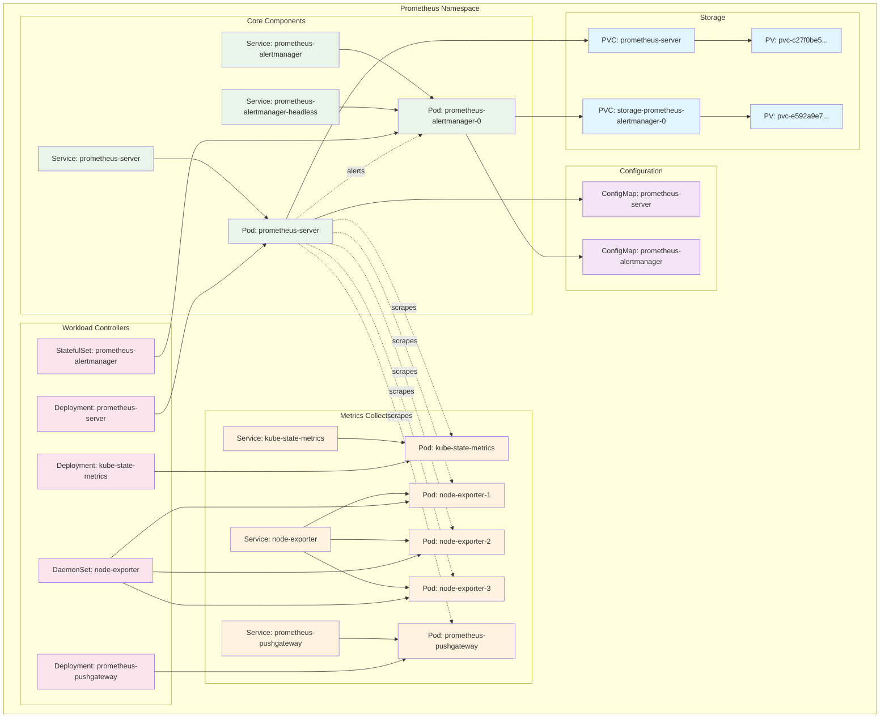
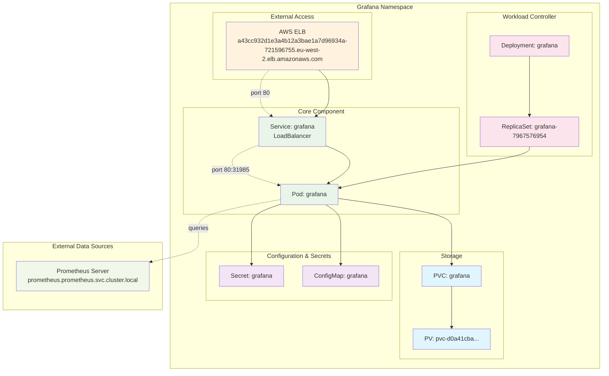
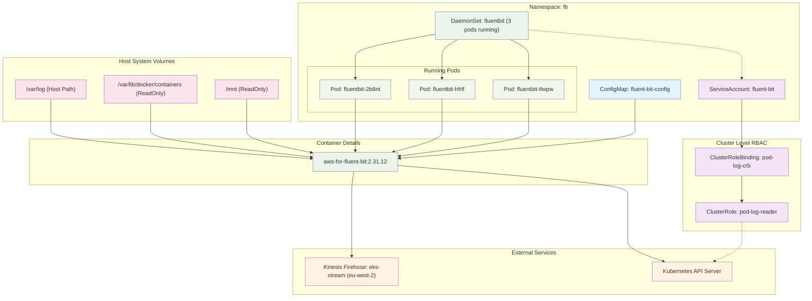

## Amazon Q CLI generated Prometheus components mermaid diagram:

Prompt was similar to this: "Create a mermaid diagram based on the running Prometheus compontens, including all relevant K8s resources"

### Same approach for the running Grafana architecture:

## Fluentbit components:

## Live FluentBit Resources Summary

**Active Components:**
- **DaemonSet**: `fluentbit` with 3 running pods across cluster nodes
- **Pods**: `fluentbit-2b8nt`, `fluentbit-hfrlf`, `fluentbit-tlwpw`
- **ConfigMap**: `fluent-bit-config` with FluentBit configuration and CRI parser
- **ServiceAccount**: `fluent-bit` for pod identity
- **ClusterRole**: `pod-log-reader` with permissions to read pods/namespaces
- **ClusterRoleBinding**: `pod-log-crb` linking ServiceAccount to ClusterRole

**Data Flow:**
1. Each pod reads container logs from `/var/log/containers/*.log`
2. Applies CRI parser to process Docker/containerd log format
3. Injects Kubernetes metadata via API server calls
4. Sends processed logs to Kinesis Firehose stream `eks-stream` in `eu-west-2`
5. 

## Another project's K8s resource components:

```mermaid
graph TB
    %% Workload Resources
    FrontendDeploy["Deployment<br/>frontend"] --> FrontendRS["ReplicaSet<br/>frontend-abc123"]
    FrontendRS --> FrontendPod["Pod<br/>frontend-abc123-xyz"]

    CatalogDeploy["Deployment<br/>prodcatalog"] --> CatalogRS["ReplicaSet<br/>prodcatalog-def456"]
    CatalogRS --> CatalogPod["Pod<br/>prodcatalog-def456-uvw"]

    LoggingDS["DaemonSet<br/>fluentd"] --> LoggingPod["Pod<br/>fluentd-node1"]

    DatabaseSS["StatefulSet<br/>postgres"] --> DatabasePod["Pod<br/>postgres-0"]

    BackupJob["Job<br/>db-backup"] --> BackupPod["Pod<br/>db-backup-123"]

    BackupCJ["CronJob<br/>nightly-backup"] --> BackupJob

    %% Networking
    FrontendSvc["Service<br/>frontend-svc"] --> FrontendPod
    CatalogSvc["Service<br/>catalog-svc"] --> CatalogPod
    DatabaseSvc["Service<br/>postgres-svc"] --> DatabasePod

    AppIng["Ingress<br/>app-ingress"] --> FrontendSvc
    AppIng --> CatalogSvc

    FrontendEP["Endpoints<br/>frontend-svc"] --> FrontendPod
    FrontendSvc --> FrontendEP

    %% Storage
    DatabasePVC["PVC<br/>postgres-data"] --> DatabasePV["PV<br/>pv-postgres-001"]
    DatabasePod --> DatabasePVC

    AppDataPVC["PVC<br/>app-uploads"] --> AppDataPV["PV<br/>pv-efs-001"]
    FrontendPod --> AppDataPVC

    EFSC["StorageClass<br/>efs-sc"] --> AppDataPV
    EBSSC["StorageClass<br/>gp3"] --> DatabasePV

    %% CSI Components
    EFSDriver["CSI Driver<br/>efs.csi.aws.com"] --> EFSC
    EBSDriver["CSI Driver<br/>ebs.csi.aws.com"] --> EBSSC

    EFSController["efs-csi-controller"] --> EFSDriver
    EBSController["ebs-csi-controller"] --> EBSDriver

    CSINode["CSI Node Plugin<br/>csi-node-driver"] --> FrontendPod
    CSINode --> DatabasePod

    %% Configuration
    AppCM["ConfigMap<br/>app-config"] --> FrontendPod
    AppCM --> CatalogPod

    DatabaseCM["ConfigMap<br/>postgres-config"] --> DatabasePod

    DatabaseSecret["Secret<br/>postgres-credentials"] --> DatabasePod
    TLSSecret["Secret<br/>tls-cert"] --> AppIng

    AppSA["ServiceAccount<br/>app-service-account"] --> FrontendPod
    AppSA --> CatalogPod

    %% RBAC
    AppRole["Role<br/>app-role"] --> AppRB["RoleBinding<br/>app-binding"]
    AppRB --> AppSA

    %% Network Policies
    AppNP["NetworkPolicy<br/>deny-all"] --> FrontendPod
    AppNP --> CatalogPod

    %% Resource Management
    ProdNS["Namespace<br/>production"] --> FrontendDeploy
    ProdNS --> CatalogDeploy
    ProdNS --> FrontendSvc
    ProdNS --> DatabasePVC
    ProdNS --> AppCM
    ProdNS --> DatabaseSecret
    ProdNS --> AppSA

    SystemNS["Namespace<br/>kube-system"] --> LoggingDS
    SystemNS --> EFSController

    %% Node Resources
    Node1["Node<br/>ip-10-0-1-100"] --> FrontendPod
    Node1 --> LoggingPod
    Node2["Node<br/>ip-10-0-2-100"] --> CatalogPod
    Node2 --> DatabasePod
    Node1 --> CSINode
    Node2 --> CSINode

    %% Style definitions
    classDef workload fill:#e1f5fe
    classDef network fill:#f3e5f5
    classDef storage fill:#e8f5e8
    classDef config fill:#fff3e0
    classDef security fill:#ffebee
    classDef cluster fill:#f5f5f5

    class FrontendDeploy,CatalogDeploy,FrontendRS,CatalogRS,FrontendPod,CatalogPod,LoggingDS,LoggingPod,DatabaseSS,DatabasePod,BackupJob,BackupPod,BackupCJ workload
    class FrontendSvc,CatalogSvc,DatabaseSvc,AppIng,FrontendEP,AppNP network
    class DatabasePVC,AppDataPVC,DatabasePV,AppDataPV,EFSC,EBSSC,EFSDriver,EBSDriver,EFSController,EBSController,CSINode storage
    class AppCM,DatabaseCM config
    class DatabaseSecret,TLSSecret,AppSA,AppRole,AppRB security
    class Node1,Node2,ProdNS,SystemNS cluster
```

## Key Relationships Explained:

**Workload Flow:**
- Deployments create ReplicaSets, which manage Pods
- Services expose Pods via Endpoints
- Ingress routes external traffic to Services

**Storage Chain:**
- Pods request storage via PVCs
- PVCs bind to PVs created by StorageClasses
- CSI controllers (EFS, EBS) provision storage through CSI drivers

**Configuration & Security:**
- ConfigMaps and Secrets provide configuration to Pods
- ServiceAccounts enable Pod authentication
- RBAC (Roles/RoleBindings) control access permissions

**Infrastructure:**
- Nodes host Pods and CSI node plugins
- Namespaces organize and isolate resources
- Cluster components (API server, scheduler, etc.) orchestrate everything
- Namespaces organize and isolate resources
- Cluster components (API server, scheduler, etc.) orchestrate everything
